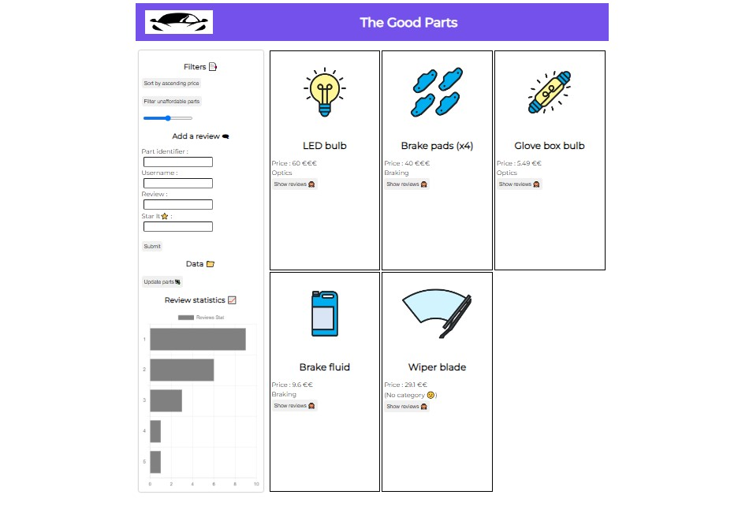

# Make It Dynamic With JavaScript 👨‍💻

## JSON Syntax

**JSON** *(JavaScript Object Notation)* is heavily inspired by the JavaScript language.

It's a rather limited file format that is used in programs written in other languages such as *Python*, *C*, or *C#*. As a result, it must adapt to all these environments.

JSON is limited to six following types:
- **The 4 primitive types of JSON:**
    - *Numbers*
    - *Strings*
    - *Booleans*
    - *The legendary **null***
- **The 2 structuring types of JSON:**
    - *Objects*
    - *Arrays*

### Here, I've learned and now know how to read, write, and modify data in JSON format 🚀👌

## fetch API in JavaScript

### Ternary Operator

Used only when we want to check between two cases.

```javascript
<condition> ? <case 1> : <case 2>
```

Provide a default value if we have *null* or *undefined* by using **nullish** syntax.

```javascript
<checkValue> ?? <(Your Default value)>
```

### sort, filter, splice & map

#### sort()

The `sort` method sorts the elements of an array by changing the original array.

The `sort` method takes an optional comparison function.
- The comparison function takes two parameters, denoted as *a* and *b*:
    - If the function returns a negative number, *a* comes before *b* in the ranking.
    - If the function returns zero, the ranking remains unchanged.
    - If the function returns a positive number, *b* comes before *a* in the ranking.

By default, the sorting order is ascending, but we can modify it by changing the order of the parameters.

For example:

```javascript
array.sort((a, b) => {
    return a - b
})
```

#### filter()

The `filter` method filters the elements of an array and returns a new array.

The new array contains values that satisfy the conditions determined by the function.

For example:

```javascript
array.filter((a) => a > 4)
```

Here, we'll have a new array with values greater than 4 😉

#### splice()

The `splice` method modifies an array by removing or adding an element to it. Here's how it's used:

```javascript
let newSpliceArray = array.splice(startIndex, numberOfElementsToRemove, elementToReplaceOrAdd)
```

For example:

```javascript
let newArray = array.splice(2, 1, "th3fr3dy")
```

Remember, when `numberOfElementsToRemove = 0`, no elements are removed or replaced. Instead, `elementToReplaceOrAdd` is added at the `startIndex`.

#### map()

I've learned to use the `map` function, which returns a new array by applying a function to each element of the array.

For example:

```javascript
let newArray = array.map((x) => x % 3)
```

Here, `newArray` will contain the remainder of the division of each value in the array by 3.

### async & await

Asynchronous programming in JavaScript.
What I've learned in this module is that in JavaScript, the `fetch` function performs an asynchronous operation.

What does this mean?
An asynchronous operation in JavaScript is a task that the browser does not block. The browser doesn't wait for the result; instead, it moves on to other things. Once the result is ready, it returns and does what was planned.

However, a problem we might encounter is when we want to wait for the request to finish before executing the next code. This is where **await** comes in, but it can only be used in an asynchronous function. To define a function as asynchronous, it must be declared with the **async** keyword—this is where **async & await** come into play.

For example:

```javascript
const returnResponses = async (id) => {
    const getData = await fetch("http://localhost:3000/data")
    return getData
}
```

`getData.json()` is used to format the received JSON data into a JavaScript object.
`getData.json().parse()` is used to reformat the data back into JSON format.

### about fetch now

When we just want to receive data, only one parameter is okay with fetch. But when we want to send data and fetch receives only a link to the data resource, how can we do it?

To use the HTTP POST verb and send data, we'll use the following syntax:

```javascript
fetch("https://localhost:3000/data", {
    method: "GET", // or "POST"
    body: JSON.stringify(dataToTransmit),
    headers: {
        "Content-Type": "application/json"
    }
})
```

#### Fetch CRUD in JavaScript

- **Create data:**

```javascript
const newData = {
    id: ${id},
    user: ${username},
    pswd: ${password}
}

fetch("https://myapi.com/data", {
    method: "POST",
    headers: { "Content-Type": "application/json" },
    body: JSON.stringify(newData)
})
```

- **Read data:**

```javascript
const getData = await fetch("https://myapi.com/data/id")
const otherFormatData = await getData.json()

console.log(otherFormatData)
```

- **Update data:**

```javascript
const dataToUpdate = {
    user: "NewUsername",
    pswd: "NewPassword"
}

fetch("https://myapi.com/data/id", {
    method: "PUT", // Maybe PATCH
    headers: { "Content-Type": "application/json" },
    body: JSON.stringify(dataToUpdate)
})
```

- **Delete data:**

```javascript
fetch("https://myapi.com/data/id", {
    method: "DELETE"
    /* headers if necessary... */
})
```

So that's all about CRUD operations using fetch in JavaScript.

## localStorage 💱

Here, I've learned how to add interactivity to my website without a data connection.

**localStorage** in JavaScript is a mechanism that allows web apps to store key-value pairs in the user's web browser.

- **How to use localStorage:**
    - To store data: `localStorage.setItem('key', 'value')`
    - To retrieve data: `localStorage.getItem('key')` to get the value for a particular key.
    - To delete or remove data from localStorage: `localStorage.removeItem('key')` removes the value for this particular key.
    - We also have `localStorage.clear()` to clean or remove all items inside localStorage.

- **Particularities of localStorage:**
    - To set a value in localStorage, this value can only have a **string** type.
    - The user's web browser only provides around (5-10)MB of storage space for each domain.
    - Data in localStorage is accessible in JavaScript running on the same domain. Avoid storing credential data inside localStorage as it's susceptible to XSS (Cross-Site Scripting) attacks.
    - Data in localStorage is synchronous.
    - Data in localStorage persists when we close and reopen the app.

## To Test It

Open your terminal:
2. Clone the repo by pasting: `git clone https://github.com/th3fr3dy/MakeItDynamicWithJS.git`
3. Navigate to the directory: `cd MakeItDynamicWithJS`
4. To install dependencies and run the app: `npm install` & `npm start`

Open another terminal in that directory:
1. Navigate to the `api-http` directory: `cd api-http`
2. To install dependencies and run the app: `npm install` & `npm start`

Now, the frontend and backend are ready. You can go to [http://127.0.0.1:8080/] to test the app.

## Demo of My Training Web App



Instagram: *@th3fr3dy* <br>
Telegram: *@th3fr3dy* <br>
My Home: [https://th3fr3dy.me]

---
